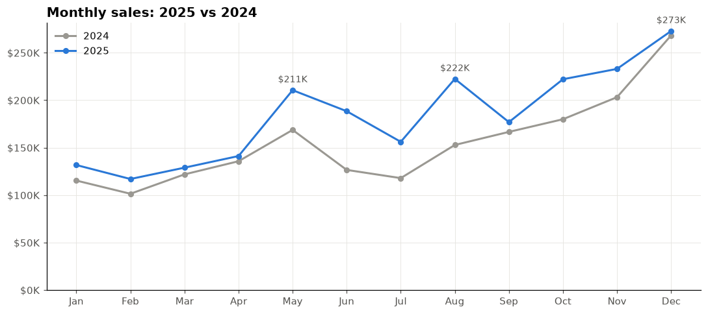
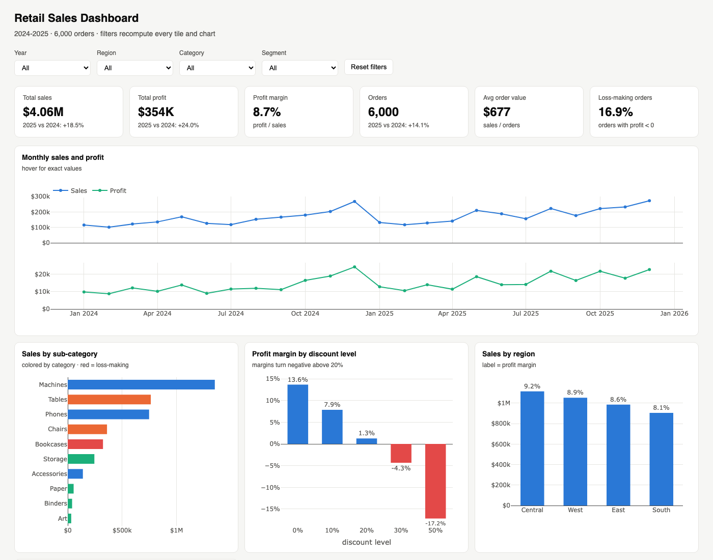
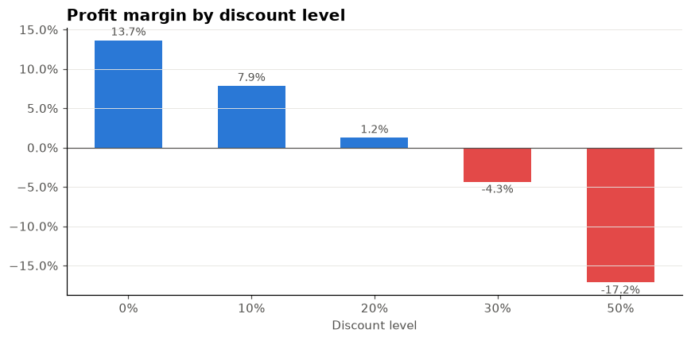
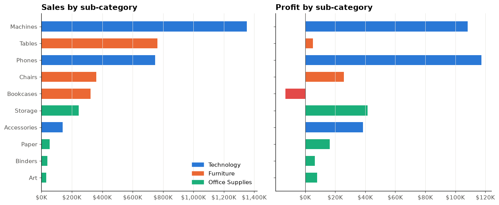
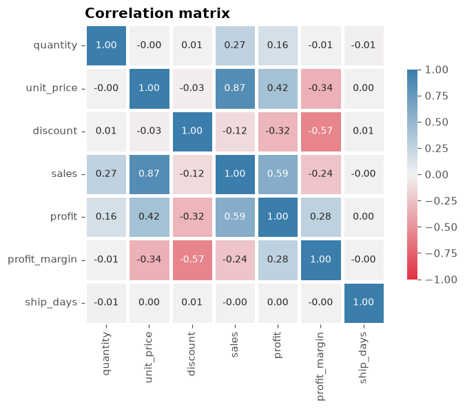
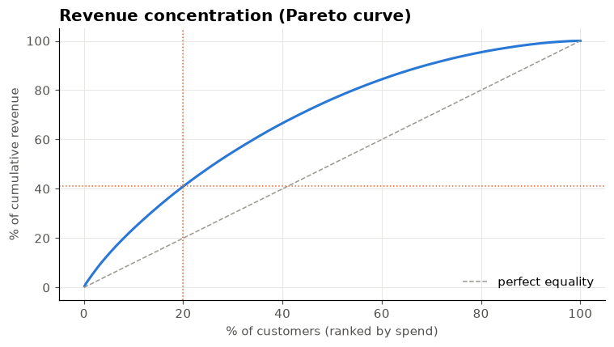

# Retail Sales Analysis

**Sunny Singh** · [LinkedIn](https://linkedin.com/in/sunny-singh-b9166a330) · [GitHub](https://github.com/sunny5491) · B.Tech AI & ML, Newton School of Technology

End-to-end data analytics project: **messy raw data -> cleaned dataset -> SQL database -> EDA notebook -> interactive dashboard -> business recommendations.**

Built as a portfolio project for a Data Analytics internship. Every step is a script you can re-run.



## Business questions answered

1. Is the business growing? **Yes: 2025 sales +18.5% YoY, positive in every month; Q4 is the peak, February the trough.**
2. Which products make or lose money? **Technology Machines + Phones = 52% of sales and 64% of profit. Bookcases lose money in every region; Tables are 19% of revenue at ~1% margin.**
3. How does discounting affect profit? **Margin falls from 13.7% (no discount) to -17% (50% off). Orders at 30%+ discount lose money on average. ANOVA p << 0.001.**
4. Are we dependent on a few customers? **No: top 20% of customers = 41% of revenue.**
5. Does shipping meet the SLA? **Yes for every ship mode.**

Full findings with evidence and recommended actions are in the last section of the [EDA notebook](notebooks/01_retail_sales_eda.ipynb).

## Project structure

```
retail-sales-analysis/
├── data/
│   ├── raw/retail_sales_raw.csv          # 6,120 rows, intentionally messy
│   ├── cleaned/retail_sales_clean.csv    # 6,000 rows, 27 columns
│   ├── cleaned/data_quality_report.md    # what was wrong and how it was fixed
│   └── retail_sales.db                   # SQLite, 3 normalized tables
├── scripts/
│   ├── 01_generate_raw_data.py           # synthetic dataset with real-world defects
│   ├── 02_clean_data.py                  # cleaning + validation + quality report
│   ├── 03_load_sqlite.py                 # CSV -> customers / products / orders tables
│   ├── 04_run_sql.py                     # runs every query, saves results to sql/results/
│   ├── 05_build_notebook.py              # builds the EDA notebook (reproducible)
│   └── 06_build_dashboard.py             # builds the interactive HTML dashboard
├── sql/
│   ├── 01_schema.sql                     # table definitions + indexes
│   ├── 02_analysis_queries.sql           # 11 analysis queries
│   └── results/*.csv                     # query outputs
├── notebooks/01_retail_sales_eda.ipynb   # EDA with 7 charts + statistics
├── dashboard/retail_dashboard.html       # interactive KPI dashboard (open in a browser)
└── images/*.png                          # charts used in this README
```

## Skills demonstrated

| Area | What was done | Where |
|---|---|---|
| Data cleaning | Mixed date formats, currency strings, inconsistent casing, duplicates, negative quantities, missing values imputed from the same customer's other orders; every fix logged and validated with asserts | `scripts/02_clean_data.py`, `data/cleaned/data_quality_report.md` |
| SQL | Normalized 3-table schema; JOINs, GROUP BY / HAVING, CTEs, window functions (`RANK`, moving average, cumulative sum), YoY self-join, date math | `sql/` |
| Python / Pandas | groupby, pivot, merge, derived metrics, Pareto analysis | notebook, scripts |
| Statistics | Descriptive stats, one-way ANOVA, Pearson correlation, distribution analysis | notebook sections 5, 6, 9 |
| Visualization | 7 charts following a consistent style (fixed categorical palette, red reserved for losses, single-axis rule) | `images/` |
| Dashboard | 6 KPI tiles, 5 charts, top-10 table, cross-filtering by year / region / category / segment | `dashboard/retail_dashboard.html` |
| Documentation | This README, quality report, commented SQL, notebook markdown | |

## Dashboard

Open `dashboard/retail_dashboard.html` in any browser. Filters (year, region, category, segment) recompute all tiles and charts client-side.



## Key charts

| Discount vs margin | Sales and profit by sub-category |
|---|---|
|  |  |

| Correlation matrix | Customer concentration |
|---|---|
|  |  |

## Recommendations

1. **Cap standard discounts at 20%.** Orders above that lose money; 16% of orders are in that zone.
2. **Fix or drop Bookcases.** Negative profit in all four regions.
3. **Reprice Tables.** Largest Furniture line but almost zero margin.
4. **Double down on Technology** for stock and marketing in Q4.
5. **Target Home Office** customers for upsell: highest margin and order value.

## How to run

```bash
pip install -r requirements.txt
python scripts/01_generate_raw_data.py
python scripts/02_clean_data.py
python scripts/03_load_sqlite.py
python scripts/04_run_sql.py
python scripts/05_build_notebook.py && jupyter nbconvert --to notebook --execute --inplace notebooks/01_retail_sales_eda.ipynb
python scripts/06_build_dashboard.py
open dashboard/retail_dashboard.html   # needs internet once, Plotly loads from CDN
```

## Data dictionary (cleaned dataset)

| Column | Type | Description |
|---|---|---|
| order_id | str | Unique order identifier |
| order_date, ship_date | date | Order placed / shipped |
| ship_days | int | ship_date - order_date |
| ship_mode | str | Same Day / First Class / Second Class / Standard Class |
| year, quarter, month, month_name, year_month | derived | Calendar fields for grouping |
| customer_id, customer_name, segment | str | Customer and segment (Consumer / Corporate / Home Office) |
| region, state, city | str | Customer location |
| category, sub_category, product_name | str | Product hierarchy (3 / 10 / 27 values) |
| quantity | int | Units ordered |
| unit_price | float | List price per unit (USD) |
| discount | float | 0, 0.1, 0.2, 0.3 or 0.5 |
| sales | float | unit_price * quantity * (1 - discount) |
| profit | float | Profit on the order (can be negative) |
| profit_margin | float | profit / sales |
| is_profitable | bool | profit > 0 |
| payment_method | str | Credit Card / Debit Card / PayPal / Cash on Delivery |

## About the data

The dataset is **synthetic**, generated by `scripts/01_generate_raw_data.py` to resemble Superstore-style US retail data (2 years, 800 customers, 27 products, 4 regions) with realistic defects injected on purpose so the cleaning step is meaningful. Absolute numbers are illustrative; the methodology is the deliverable.
